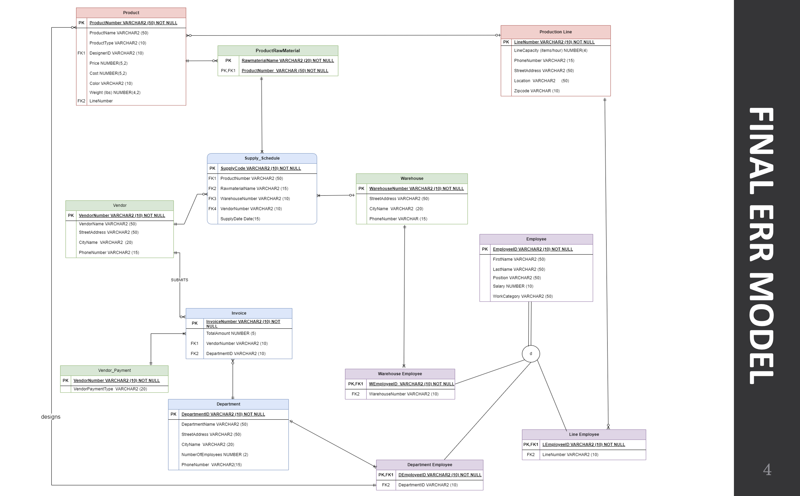

# Caterpillar ERP Database Design

## Overview

This repository contains the comprehensive work done during my internship at Caterpillar, focusing on designing an ERP (Enterprise Resource Planning) Database. The project involved creating a robust, normalized database structure to efficiently manage and integrate various business processes across departments.

## Project Objectives

- **Design a scalable and normalized database** to support various ERP functions.
- **Create and optimize tables** to store critical business data, ensuring data integrity and minimizing redundancy.
- **Develop an Entity-Relationship (ER) diagram** to visualize the relationships between different entities in the system.

## Key Features

- **Comprehensive Database Design**: The database is structured to handle complex relationships between different entities, including employees, vendors, products, and supply schedules.
- **Normalization**: The database design follows the principles of normalization up to the third normal form (3NF), ensuring data redundancy is minimized and data integrity is maintained.
- **Efficient Data Management**: The use of primary and foreign keys, along with other constraints, ensures efficient data management and retrieval.

## Database Structure

The database consists of the following key tables:

| Table Name            | Description                                                                 |
|-----------------------|-----------------------------------------------------------------------------|
| **Department**        | Contains details about each department in the organization.                 |
| **Employee**          | Stores employee data, linked to the Department and Warehouse tables.        |
| **Vendor**            | Holds information about vendors supplying raw materials and other products. |
| **Product**           | Lists all products, including raw materials and finished goods.             |
| **Supply Schedule**   | Manages the supply schedules for raw materials from various vendors.        |
| **Invoice**           | Tracks invoices related to purchases and payments made to vendors.          |
| **Warehouse**         | Details about warehouses, including their locations and capacity.           |

## Normalization

### 1. **First Normal Form (1NF)**
- All tables contain atomic data, ensuring that each column holds a single value.
- Example: In the `Employee` table, fields such as `FirstName`, `LastName`, and `DepartmentID` are atomic.

### 2. **Second Normal Form (2NF)**
- The database is free of partial dependencies, with every non-key attribute fully dependent on the primary key.
- Example: In the `Product` table, all non-key attributes (e.g., `ProductName`, `CategoryID`) depend solely on the `ProductID`.

### 3. **Third Normal Form (3NF)**
- The database is free of transitive dependencies, ensuring that non-key attributes are only dependent on the primary key.
- Example: In the `Invoice` table, attributes such as `VendorID` and `Amount` are directly dependent on the `InvoiceID`.

## Entity-Relationship Diagram

The following ER diagram provides a visual representation of the relationships between the various entities in the database:

## Conclusion

This project at Caterpillar provided valuable insights into the practical aspects of database design and management. By adhering to normalization principles and creating a well-structured database, we ensured that the ERP system could efficiently handle the organization's data, supporting various business functions.

For more details, please refer to the [ERP Database Design Report](ERP_DATABASE_DESIGN_REPORT.pdf).

## License

This project is licensed under the MIT License - see the [LICENSE](LICENSE) file for details.
